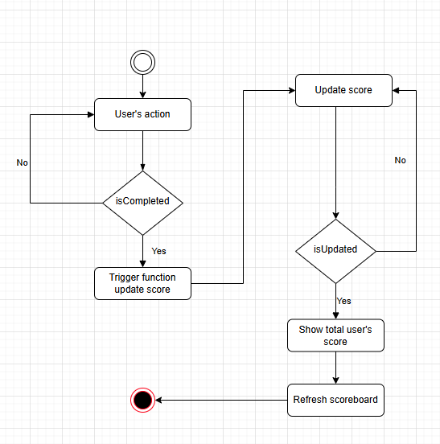

# Scoreboard API Service

## Overview

The Scoreboard API Service handles score updates for users in real-time. User's score will be updated after complete an action

## API Endpoints

**Path**: /update-score

**Method**: POST

**Authentication**: JWT token required

### API Flow



**Description**: This endpoint is called when a user completes an action that results in a score update.

### Request Body:

```json
{
    "action": "actionName",
    "score": 1,
    "signature": "signature"
}
```

-   `action`: name of action
-   `score`: score increment of user's action
-   `signature`: encrypted by SHA256 algorithm with `action`,`score` and user's `secretKey`

### Response Body:

```json
{
    "errorCode": "00",
    "message": "Update score successfully",
    "data": {
        "userId": "abc",
        "username": "username",
        "totalScore": 99
    }
}
```
